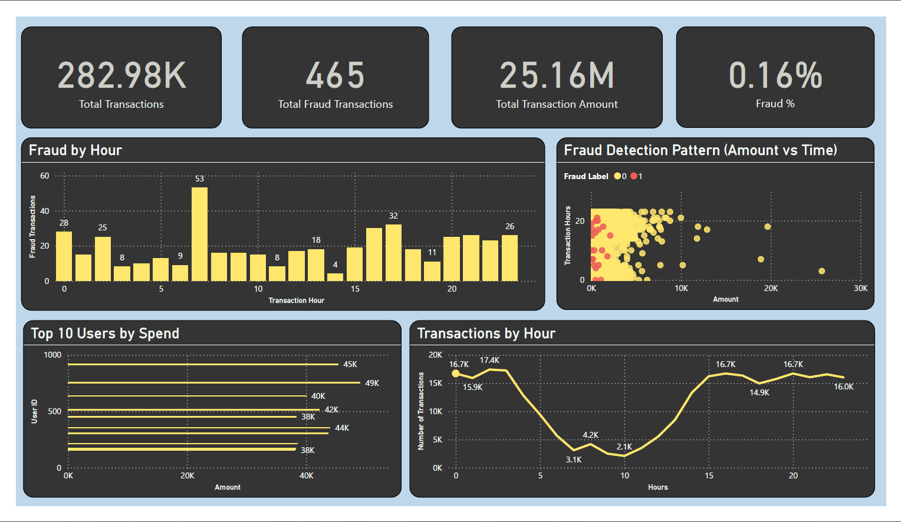

# 📊 Bank Transaction ETL and Fraud Analytics

---

## 🚀 Project Overview

This project simulates a **real-world banking data pipeline**, where raw transaction data is ingested, cleaned, transformed, and analyzed to generate meaningful business insights.

It also includes **fraud detection and anomaly detection**, making it a complete **end-to-end Data Engineering + Analytics project**.

---

## ❗ Problem Statement

Banks process millions of transactions daily, but:

* Raw data is often **inconsistent and unstructured**
* Fraud transactions are **rare but critical**
* Insights are not directly available without transformation

👉 The goal is to build a system that:

* Cleans and structures raw data
* Enables analytical insights
* Detects suspicious transactions

---

## 🎯 Objectives

* Build an **ETL pipeline using PySpark**
* Perform **data cleaning and transformation**
* Generate **analytical insights using SQL**
* Detect **fraud and anomalies**
* Create a **dashboard using Power BI**

---

## 🛠️ Tech Stack

| Category        | Tools                      |
| --------------- | -------------------------- |
| Language        | Python                     |
| Big Data        | PySpark                    |
| Data Processing | Pandas                     |
| Querying        | SQL                        |
| Visualization   | Power BI                   |
| Storage         | CSV                        |
| Environment     | Virtual Environment (venv) |

---

## 🔄 ETL Pipeline Architecture

```
Raw CSV Data
     ↓
Data Ingestion (PySpark)
     ↓
Data Cleaning
     ↓
Data Transformation
     ↓
SQL Analysis
     ↓
Anomaly Detection
     ↓
Processed Data (CSV)
     ↓
Power BI Dashboard
```

---

## 📂 Project Structure

```
Banking-Transaction-ETL-Pipeline/
│
├── data/
│   ├── raw/
│   │   └── transactions.csv
│   ├── processed/
│   │   └── transactions.csv
│
├── src/
│   ├── ingestion/
│   │   └── load_data.py
│   ├── cleaning/
│   │   └── clean_data.py
│   ├── transformation/
│   │   └── transform_data.py
│   ├── sql/
│   │   └── analysis.py
│   ├── anomaly_detection/
│   │   └── detect_anomalies.py
│
├── main.py
|
├── dashboard/
│   └── dashboard.png
│
├── requirements.txt
└── README.md
```

---

## ⚙️ Key Features

### 🔹 Data Ingestion

* Loaded **280K+ transaction records**
* Schema inferred using PySpark

---

### 🔹 Data Cleaning

* Removed null values
* Standardized column names
* Ensured data consistency

---

### 🔹 Data Transformation

Created new features:

* `transaction_hour`
* `transaction_timestamp`
* `is_high_value`
* `transaction_type`

---

### 🔹 SQL Analysis

Performed business insights:

* 💰 Total Spend Per User
* 🚨 Fraud Transaction Count
* 💳 High Value Transactions

---

### 🔹 Anomaly Detection

* Used **Z-score method**
* Detected **outlier transactions**
* Flagged suspicious activity

---

## 📊 Dashboard Preview



---

## 💡 Key Insights

* Fraud transactions are **extremely rare (~0.16%)**
* Majority of transactions are **low-value**
* High-value transactions are **potential fraud indicators**
* Spending is concentrated among **few users**

---

## ▶️ How to Run the Project

### 1. Clone Repository

```
git clone https://github.com/your-username/Banking-Transaction-ETL-Pipeline.git
cd Banking-Transaction-ETL-Pipeline
```

### 2. Download Dataset

```
Credit Card Fraud Detection: 
https://www.kaggle.com/datasets/mlg-ulb/creditcardfraud
```

---

### 3. Create Virtual Environment

```
python -m venv bankvenv
bankvenv\Scripts\activate
```

---

### 4. Install Dependencies

```
pip install -r requirements.txt
```

---

### 5. Run ETL Pipeline

```
python -m src.ingestion.load_data
```

---

### 6. Output

Processed data will be saved at:

```
data/processed/transactions.csv
```

---

### 7. Open Dashboard

* Open Power BI
* Load `transactions.csv`
* Recreate visuals

---

## 📌 Resume Points Covered

✔ Data Processing (280K+ records)
✔ Data Cleaning & Transformation
✔ SQL-Based Analytics
✔ Fraud & Anomaly Detection
✔ Dashboard Visualization

---

## 🔥 Future Improvements

* Add **Machine Learning Fraud Detection Model**
* Use **Apache Airflow for scheduling**
* Store data in **Data Warehouse (Snowflake/Redshift)**
* Build **real-time pipeline using Kafka**

---

## 👩‍💻 Author

**Chhandavi Gowardhan**                                                                                                     Aspiring Data Analyst

---

## ⭐ Conclusion

This project demonstrates:

* End-to-end **data pipeline development**
* Strong **data analytics skills**
* Real-world **fraud detection use case**

